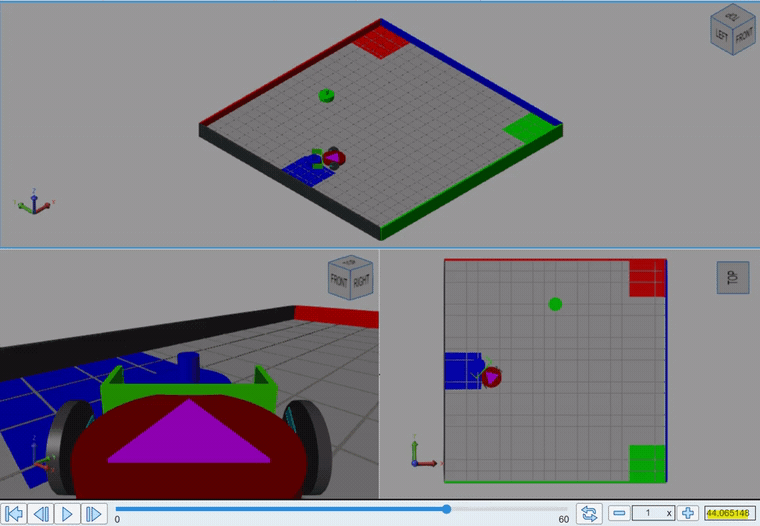
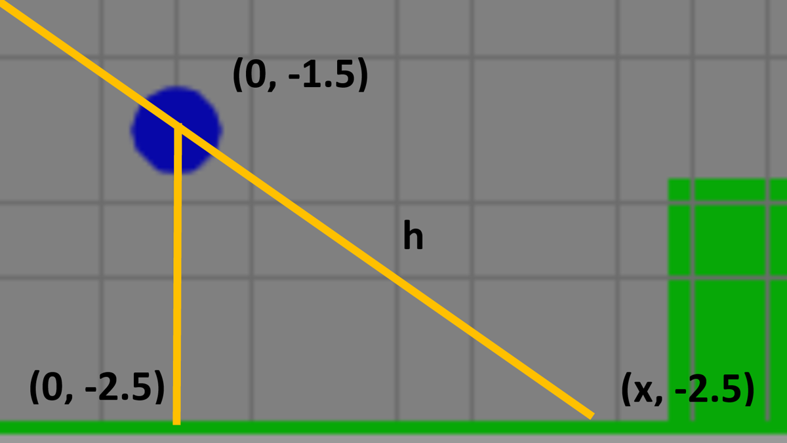
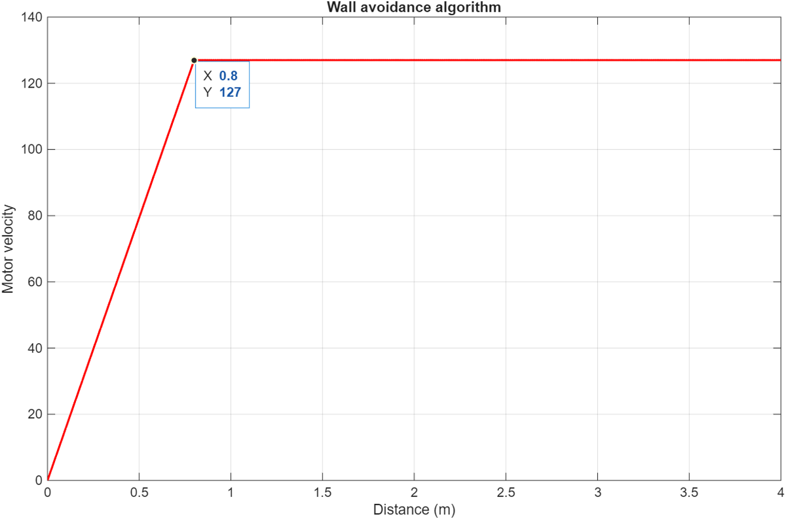

<div align="center">

# Autonomous Object Sorting using a Mobile Robot

**A state-machine-driven mobile robot that detects colored objects, plans a roadmap, and plows each object into its matching collection zone — built and validated in MATLAB / Simulink.**

[](https://www.mathworks.com/products/matlab.html)
[](https://www.mathworks.com/products/simulink.html)
[](https://www.mathworks.com/products/stateflow.html)
[](https://www.stevens.edu/)
[](LICENSE)



</div>

## Overview

This project implements a complete autonomous object-sorting pipeline for a differential-drive mobile robot operating in a 5 m × 5 m walled arena. Two colored objects (any of red, green, blue) start near the center of the field, and the robot must relocate each one to its matching collection zone — without colliding with the surrounding walls.

The control system is implemented entirely inside a single MATLAB Function block within Simulink, with an explicit, persistent **state machine** driving the high-level behavior: determine object color → plan a path → navigate → plow into the collection zone → return home and repeat. A reusable **navigation routine** moves the robot along an ordered queue of waypoints, while a precomputed **roadmap** of "Pre-Plow Positions" (PPP) guarantees each object can be delivered to its zone in a single straight push.

Everything is developed and validated in the MATLAB Robotics Playground simulation environment across all six possible object/color initial conditions.

## Key Features

- **State-machine control** — high-level behavior modeled as discrete states, persisted across simulation steps with MATLAB's `persistent` keyword.
- **Color-based perception** — an onboard object sensor reports distance and angle for red, green, and blue targets (range ≈ 0.38–2.0 m, ±30°).
- **Roadmap planning with Pre-Plow Positions** — each object/color configuration maps to a geometrically derived PPP from which a single straight motion plows the object into its zone.
- **Reusable navigation routine** — drives the robot through an arbitrary queue of waypoints (spin-to-heading → move-until-arrived with a tunable arrival tolerance).
- **Wall / collision avoidance** — a saturated ramp velocity law eases the robot away from walls using the left/front/right distance sensors instead of stopping abruptly.
- **Validated across all 6 initial conditions** — every bottom/top color permutation is exercised in simulation.

## Demo

<div align="center">

<br><em>The robot (magenta) navigates the arena and delivers each object to its color-matched collection zone.</em>
</div>

## Architecture

The controller is a sequential state machine. Each loop, the robot evaluates its current state, executes the corresponding behavior, and advances when the goal is reached:

```
                 +-----------------------------+
                 |            START            |
                 +--------------+--------------+
                                v
                 +-----------------------------+
                 |  Initialize object counter  |
                 +--------------+--------------+
                                v
        +-----------------------------------------------+
        |  More objects left to sort?                   |
        +-------+-------------------------------+-------+
            yes |                                | no
                v                                v
   +--------------------------+         +-----------------+
   | Determine object color   |         |  Return home    |
   +------------+-------------+         |   -> END         |
                v                        +-----------------+
   +--------------------------+
   | Plan path  (PATH_PLANNER)|  -- picks roadmap entry + Pre-Plow Position
   +------------+-------------+
                v
   +--------------------------+
   | Navigate queue           |  -- spin-to-heading, move-until-arrived
   | (reusable nav routine)   |
   +------------+-------------+
                v
   +--------------------------+
   | Plow into collection zone|
   +------------+-------------+
                v
   +--------------------------+
   | Increment counter  ----------> (loop back to "objects left?")
   +--------------------------+
```

Supporting modules:

| Module | Role |
| --- | --- |
| `PATH_PLANNER.m` | Builds the ordered waypoint queue for the active object/color, including guard waypoints and the final plow motion. |
| `DETERMINE_CLOSEST_POINT.m` | Returns the nearest roadmap waypoint to the robot (Euclidean), choosing where to enter the roadmap. |
| Wall-avoidance ramp | Maps wall distance to motor velocity via a saturated ramp (see `graphs.m`). |
| Roadmap / Pre-Plow geometry | Precomputed entry points so each object reaches its zone in one straight push. |

<div align="center">


<br><em>Left: Pre-Plow Position geometry. Right: the wall-avoidance velocity ramp.</em>
</div>

## Repository Structure

```
.
├── src/
│   ├── main_robot.slx              # Top-level Simulink model (run this)
│   ├── ME598_ProjectLibrary.slx    # Robot sensors, arena & playground blocks
│   ├── PATH_PLANNER.m              # Per-configuration waypoint planning
│   ├── DETERMINE_CLOSEST_POINT.m   # Nearest-roadmap-waypoint helper
│   └── graphs.m                    # Figure/plot generation (roadmap, ramp, trajectory)
├── docs/
│   ├── Final_Project_Report.pdf    # Full project report
│   ├── ME598_Project_Brief.pdf     # Original assignment brief
│   ├── notes/                      # Algorithm & system-characterization design notes
│   └── media/                      # Demo GIF/MP4 and result figures
├── LICENSE
└── README.md
```

## Getting Started

### Prerequisites

- MATLAB (R2023b or newer recommended)
- Simulink
- The MATLAB Robotics Playground / simulation environment used in ME 598

### Run the simulation

1. Clone the repository:
   ```bash
   git clone https://github.com/aaronreycast/Autonomous-Object-Sorting-using-a-Mobile-Robot.git
   ```
2. Open MATLAB and set the `src/` folder as the current working directory (so the `.m` functions and library are on the path).
3. Open and run the model:
   ```matlab
   open_system('main_robot.slx')
   ```
4. Set the arena initial condition (bottom/top object colors), then start the simulation and watch the robot sort both objects.
5. To regenerate the report figures (roadmap, wall-avoidance ramp, trajectory), run the relevant sections of `graphs.m` after a simulation produces the `xPose` / `yPose` logs.

## My Contributions

This was a four-person team project for ME 598 (Group R2: Jefrey Bulla, Reece Paz, Aaron Reyes, Pratham Waghela). My individual contributions were:

- **Roadmap / path design** — helped determine the analytical starting point for the roadmap and ran tests to tune the path waypoints (Pre-Plow Positions) so each object follows a collision-free route to its zone.
- **Wall-avoidance algorithm (report)** — helped develop the wall-avoidance approach and documented it in the project report, including the supporting analysis and figures.

The Simulink state machine, the path-planning code, and the broader Pre-Plow Position derivation were developed collaboratively with my teammates.

## Tech Stack

- **MATLAB** — algorithm implementation (`PATH_PLANNER`, `DETERMINE_CLOSEST_POINT`, plotting).
- **Simulink** — model-based design of the control system and robot/arena simulation.
- **State machine** — sequential control logic via a MATLAB Function block with persistent state.

## Possible Extensions

- Replace the precomputed roadmap with online path planning (e.g., A* or RRT) so the system generalizes to arbitrary object/zone layouts.
- Add closed-loop heading control (PID) for smoother spin-and-move transitions.
- Generalize perception to estimate object pose directly rather than relying on fixed start slots.
- Port the controller to a ROS 2 node and run it on physical hardware (the state machine maps cleanly onto a behavior tree).

## License

Released under the MIT License — see [LICENSE](LICENSE).

## Author

**Aaron Reyes Castillo**
[GitHub @aaronreycast](https://github.com/aaronreycast) · [LinkedIn](https://www.linkedin.com/in/al-reyes-castillo/)
